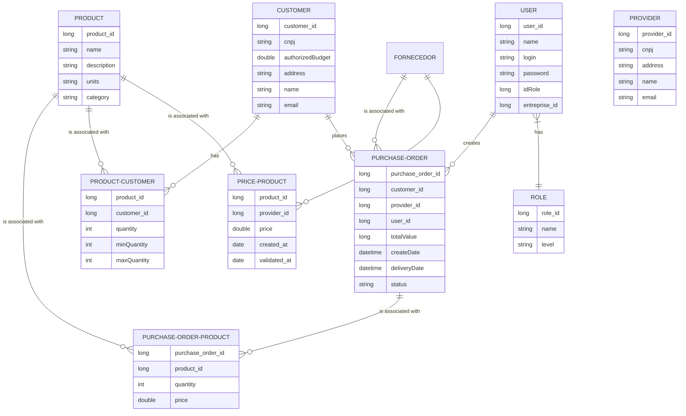

## Mermaid

```mermaid
erDiagram
    PRODUCT ||--o{ PURCHASE-ORDER-PRODUCT : "is associated with"
    PURCHASE-ORDER ||--o{ PURCHASE-ORDER-PRODUCT : "is associated with"
    CUSTOMER ||--o{ PRODUCT-CUSTOMER : "has"
    PRODUCT ||--o{ PRODUCT-CUSTOMER : "is associated with"
    CUSTOMER ||--o{ PURCHASE-ORDER : "places"
    FORNECEDOR ||--o{ PURCHASE-ORDER : "is associated with"
    FORNECEDOR ||--o{ PRICE-PRODUCT : "has"
    PRODUCT ||--o{ PRICE-PRODUCT : "is associated with"
    USER ||--o{ PURCHASE-ORDER : "creates"
    USER |{--|| ROLE : "has"

    PRODUCT {
        long product_id
        string name
        string description
        string units
        string category
    }

    PRODUCT-CUSTOMER {
        long product_id
        long customer_id
        int quantity
        int minQuantity
        int maxQuantity
    }

    PRICE-PRODUCT {
        long product_id
        long provider_id
        double price
        date created_at
        date validated_at
    }

    PURCHASE-ORDER-PRODUCT{
        long purchase_order_id
        long product_id
        int quantity
        double price
    }


    PURCHASE-ORDER {
        long purchase_order_id
        long customer_id
        long provider_id
        long user_id
        long totalValue
        datetime createDate
        datetime deliveryDate
        string status

    }

    CUSTOMER {
        long customer_id
        string cnpj
        double authorizedBudget
        string address
        string name
        string email
    }

    USER {
        long user_id
        string name
        string login
        string password
        long idRole
        long entreprise_id
    }

    ROLE {
        long role_id
        string name
        string level
    }

    PROVIDER {
        long provider_id
        string cnpj
        string address
        string name
        string email
    }
```