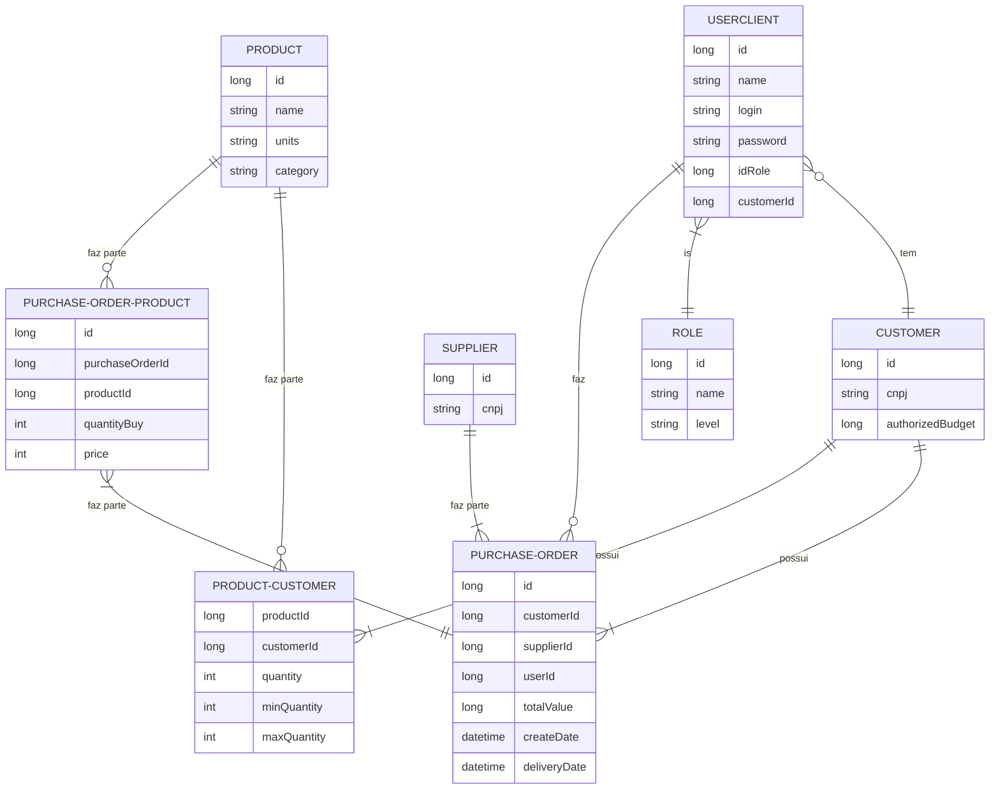

## Mermaid

```mermaid
erDiagram

    PRODUCT ||--o{ PURCHASE-ORDER-PRODUCT : "faz parte"
    PRODUCT ||--o{ PRODUCT-CUSTOMER : "faz parte"
    PURCHASE-ORDER-PRODUCT }|--|| PURCHASE-ORDER : "faz parte"
    CUSTOMER ||--|{ PRODUCT-CUSTOMER : "possui"
    CUSTOMER ||--|{ PURCHASE-ORDER : "possui"
    SUPPLIER ||--|{ PURCHASE-ORDER : "faz parte"
    USERCLIENT ||--o{ PURCHASE-ORDER : "faz"
    USERCLIENT }|--|| ROLE : "is"
    USERCLIENT }o--|| CUSTOMER : "tem"


    PRODUCT {
        long id
        string name
        string units
        string category
    }


    PRODUCT-CUSTOMER {
        long productId
        long customerId
        int quantity
        int minQuantity
        int maxQuantity
    }


    PURCHASE-ORDER-PRODUCT{
        long id
        long purchaseOrderId
        long productId
        int quantityBuy
        int price
    }


    PURCHASE-ORDER {
        long id
        long customerId
        long supplierId
        long userId
        long totalValue
        datetime createDate
        datetime deliveryDate

    }


    CUSTOMER {
        long id
        string cnpj
        long authorizedBudget
    }

    USERCLIENT {
        long id
        string name
        string login
        string password
        long idRole
        long customerId
    }

    ROLE {
        long id
        string name
        string level
    }

    SUPPLIER {
        long id
        string cnpj
    }
```