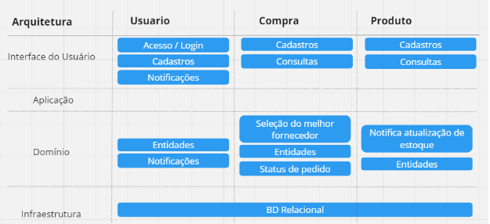

# Tech Challenge - 2ADJT
## Fase 1
<!-- TOC -->
* [Tech Challenge - 2ADJT](#tech-challenge---2adjt)
    * [Especificação](#especificação)
    * [Problema](#problema)
        * [As-is](#as-is)
        * [Objetivo (to-be)](#objetivo-to-be)
    * [Event Storming](#event-storming)
    * [Arquitetura](#arquitetura)
    * [Modelo Entidade Relacionamento](#modelo-entidade-relacionamento)
<!-- TOC -->

## Especificação

| Tecnologia | Versão |
|------------|--------|
| Java       | 17     | 
| Maven      |        | 
| H2         |        |

## Problema

Uma empresa de compras, precisa gerenciar o estoque de uma variedade de restaurantes. E a partir disto, fazer a gestão de diversos fornecedores e efetivar a melhor compra.

### As-is
Hoje a vistoria é presencial e manual, feita pela administradora, usando um caderno no local, sempre acompanhada de um responsável pelo restaurante, gerando conflitos de agenda e gastos de locomoção e tempo
Existe uma política de pré-aprovação de compra dentro de um valor estabelecido pelo restaurante.
Cada fornecedor tem um valor mínimo de compra para ser entregue, ou seja, para fechar uma compra, o valor total tem que atender a esse limite, senão precisa ser feita com mais item.
Neste cenário não temos escalabilidade.

### Objetivo (to-be)
- Minimum Viable Product (MVP)
    - O restaurante tem acesso à uma plataforma onde ele pode se conectar e definir uma lista de produtos do seu estoque e um estoque mínimo de cada item. Além da criação do estoque, um funcionário do restaurante poderá modificar a quantidade do estoque de cada item quando fizer o inventário A compradora terá acesso à mesma plataforma para inserir os fornecedores e os preços de cada produto para cada fornecedor. (política: O preço tem uma data de expiração). A compradora é notificada quando um ou mais produtos atingem o mínimo necessário no estoque. Então ela compara o preço deste produto para cada fornecedor, seleciona o melhor fornecedor para cada item e cria um pedido de compra. Ao receber o pedido de compra o fornecedor trata diretamente com o restaurante para a entrega e o pagamento. Uma vez o pedido entregue, o restaurante confirma a recepção na plataforma e o estoque é atualizado.
- Versão futura (Backlog)
    - A compra ser efetuada automaticamente, desde que dentro de um valor máximo estipulado pelo restaurante, senão, fica em status aguardando confirmação (essa fase pode exigir descrever forma de pagamento e comprovação)

## Event Storming
[Miro](https://miro.com/app/board/uXjVOXLcUnw=/?share_link_id=171517775181)

## Arquitetura

## Modelo Entidade Relacionamento
[Modelo-ER](DOCS/modelo-er.md)
